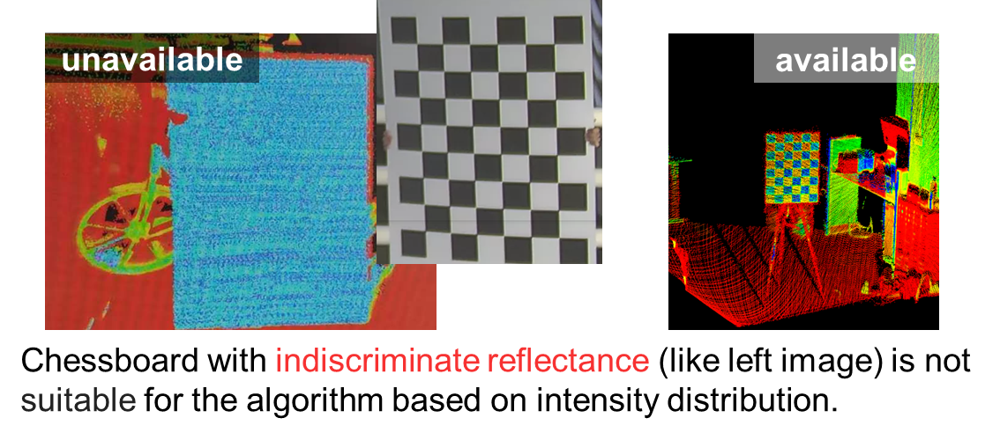
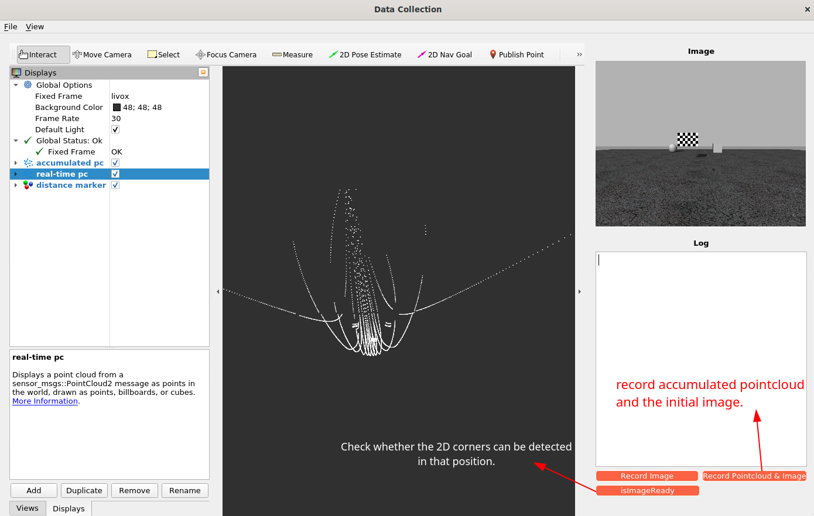
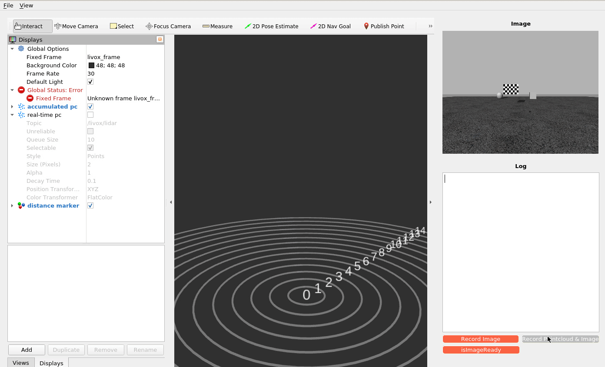
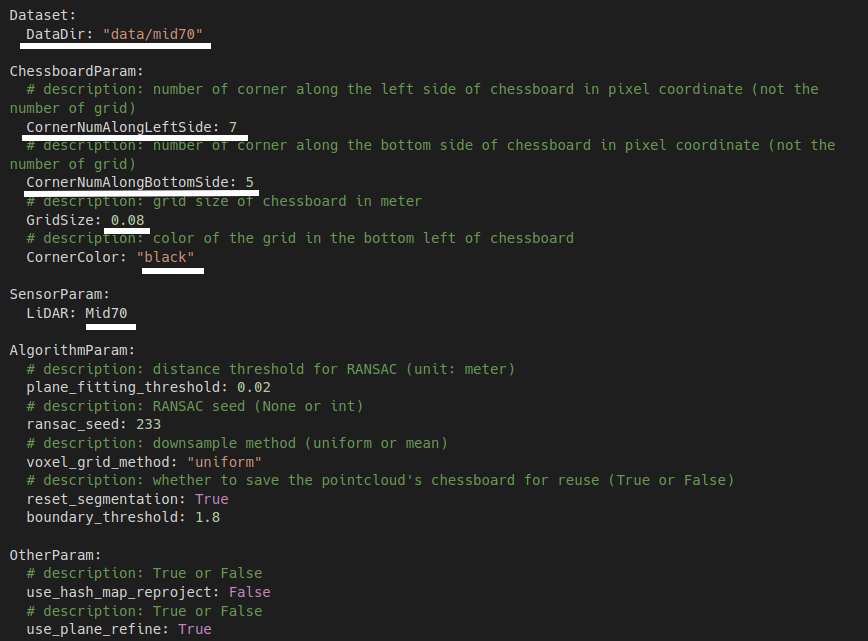
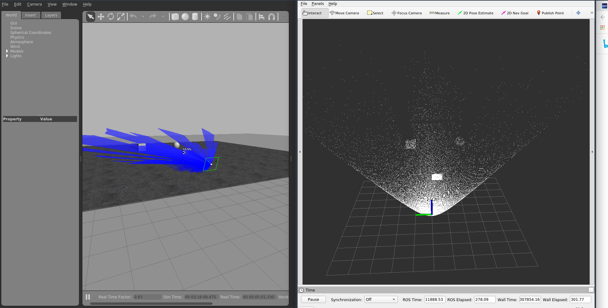

# ARTSCalib

> **Note**
>
> Due to the maintainer being busy with graduation defense, a refactored and cleaner version of the code, along with a
> more detailed documentation, will be added later.

<div align="center">

English | [简体中文](README_cn.md)
</div>

## 1. Introduction

This is an extrinsic calibration tool for non-repetitive scanning LiDAR and camera based on **chessboard **. The main
contribution is to improve the robustness and accuracy of segmentation based on image-based representation, and reduce
the manual intervention in target-based methods, such as parameter tuning and manual
selection of calibration object position. This work is an extension of [ACSC](https://github.com/HViktorTsoi/ACSC)
and [ILCC](https://github.com/mfxox/ILCC), mainly contributing to the chessboard calibration segmentation and proposing
some ideas on the intensity threshold segmentation and PnP algorithm. It has the following features:

- **User-friendly**: No need to adjust parameters, such as dynamically adjusting the passthrough filter to roughly
  select the position of the calibration board; the calibration board can be handheld or placed on a stool; the bottom
  edge of the calibration board is not required to be parallel to the ground; and when certain conditions are met, it
  can be directly placed on the ground.
- **High precision**: Five appropriate positions can obtain high-precision extrinsic parameters.
- **More general API**: The `Open3D` library is used for point cloud processing, which is easier to install compared to
  the `python-pcl` library that is removed and difficult to maintain in `ACSC`.
- **More user-friendly interaction interface**: The `PyQt` and `Rviz` are combined for interaction, providing a more
  user-friendly data acquisition interface.

## 2. Requirements

- ROS

|           —            | UI for data collection | extrinsic calibration |     simulation     |
|:----------------------:|:----------------------:|:---------------------:|:------------------:|
| Ubuntu20.04 ROS Noetic |   :heavy_check_mark:   |  :heavy_check_mark:   | :heavy_check_mark: |
| Ubuntu22.04 ROS Humble |          :x:           |  :heavy_check_mark:   |        :x:         |

> **Note**
>
> (1) The UI program is developed based on the ROS RViz Python extension library, so the current Python version of the
> calling environment needs to be consistent with the Python version encapsulated during development. For example,
> ROS-Melodic corresponds to Python 2.7, and ROS-Noetic corresponds to Python 3.8. If they are inconsistent, it is
> necessary to compile the Python extension library from the source code and import relevant environment variables. It
> is
> not recommended for those who are not proficient in this environment configuration to use.
>
> (2) If using a conda environment, the Python interpreter used should also correspond to the corresponding version
> mentioned in (1).

- Python

```bash
$ git clone https://github.com/Natsu-Akatsuki/ARTSCalib
$ pip3 install -r requirements.txt

# To use the data collection UI, additional installation is required:
$ pip install PyQt5 rospkg rospy
```

- [PointCloud-PyUsage](https://github.com/Natsu-Akatsuki/PointCloud-PyUsage)（a custom point cloud processing library.）

```bash
$ pip3 install -U --user build pip setuptools wheel
$ sudo apt install pybind11-dev
$ git clone https://github.com/Natsu-Akatsuki/PointCloud-PyUsage --depth=1
$ cd PointCloud-PyUsage
$ bash install.sh
```

## 3. Chessboard target

Previously, foam board chessboards were used, but the contrast between black and white squares was not significant.
Later, a customized calibration board was used, which is made of `5cm` thick Shaffer board with black UV-coated squares
arranged in an 8x5 pattern with a size of 0.08m.

<p align="center">

</p>


## 4. Procedure

Step 1: Obtain camera intrinsics and distortion coefficients (e.g. using Matlab calibration tool)

Step 2: Data acquisition

(1) If using the UI:

- Start the ROS nodes related to the LIDAR and camera drivers

```bash
# e.g.
$ roslaunch livox_ros_driver livox_lidar.launch
```

- Start the data collection UI (currently not tested on 18.04), which supports collecting point cloud data in `xyzi`
  format.

```bash
$ cd ui

# Step 1: Modify the parameters in ui/data_collection.yaml (e.g. ROS topics, chessboard pattern, whether to horizontally flip images, etc.)
...
# Step 2: Launch the program.
$ python ui/ui.py
```





> **Note**
>
> The exported images may be inverted in color. To fix this, you can use the rgb2bgr API from the Python OpenCV library.

```bash
$ python3 ui.py
```

The exported data folder is as follows. At the same time, create a `sensor.yaml` file in this directory based on the
reference `sensor-template.yaml`, and fill in the camera's intrinsic parameters and distortion coefficients (the
external parameters part is for placeholder and can be ignored).

```bash
.data
├── 04-09-12-19-29
│   ├── img
│   ├── img_for_intrinsic
│   ├── pointcloud
│   └── sensor.yaml <-需参考sensor-template.yaml自行添加
└── sensor-config.yaml
```

(2) If the data is obtained by other methods, the directory tree should be constructed as follows.

```bash
├── data
│   ├── dir_name
│   │   ├── img
│   │   │   ├── 000000.png
│   │   │   ├── 000001.png
│   │   │   ├── 000002.png
│   │   │   ├── 000003.png
│   │   ├── pointcloud
│   │   │   ├── 000000.pcd
│   │   │   ├── 000001.pcd
│   │   │   ├── 000002.pcd
│   │   │   ├── 000003.pcd
│   │   └── sensor.yaml
```

Step 3: Adjust the parameters in the configuration file `config/config.yaml` according to the dataset path, sensor type,
and checkerboard type.



```bash
$ python3 calibration_node.py -cfg config/config.yaml
# The generated extrinsic parameters are located in sensor.yaml.
```

Step 4: Perform qualitative and quantitative analysis.

```bash
$ python3 experiment.py -cfg config/config.yaml
```


## 5. Other usage（To be continued）

### 5.1 Simulation

```bash
$ cd simulation/livox_simulation/
$ catkin build
$ source devel/setup.bash

# For avia
$ roslaunch livox_laser_simulation avia_camera_calibration.launch
# For horizon
$ roslaunch livox_laser_simulation horizon_camera_calibration.launch
# For mid40
$ roslaunch livox_laser_simulation mid40_camera_calibration.launch
# For mid70
$ roslaunch livox_laser_simulation mid70_camera_calibration.launch

# For developer (docker user)
(docker) $ export DISPLAY=:0
(docker) $ __NV_PRIME_RENDER_OFFLOAD=1 __GLX_VENDOR_LIBRARY_NAME=nvidia roslaunch livox_laser_simulation mid70_camera_calibration.launch
```



### 5.2 Target Segmentation

```bash
# Segmentation of specific point cloud files can be done by debugging and checking the results.
# Segmentation of point clouds in frame 0 and frame 1.
$ python3 target_segmentation.py --cfg config/horizon.yaml --idx 0 1
```
