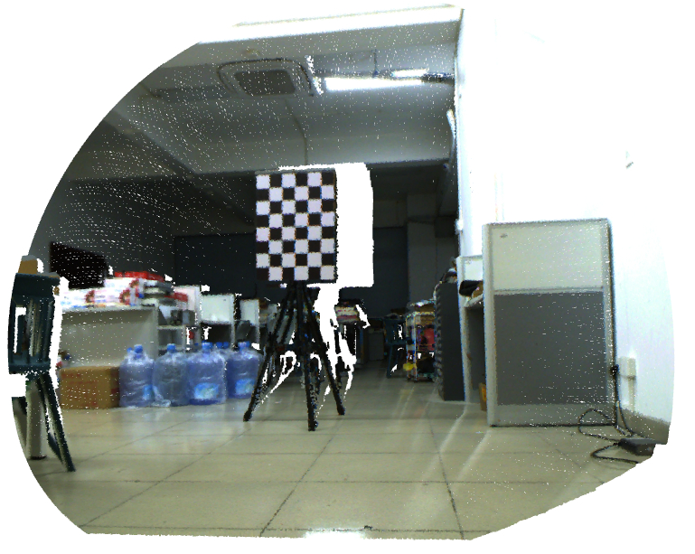

<style>
.markdown-section table {
    width: 70%;
    margin-left: auto;
    margin-right: auto;
}
</style>

# Getting Started

## Install

- Install ROS

|        Version         | UI for data collection | Extrinsic calibration |     Simulation     |
|:----------------------:|:----------------------:|:---------------------:|:------------------:|
| Ubuntu20.04 ROS Noetic |   :heavy_check_mark:   |  :heavy_check_mark:   | :heavy_check_mark: |
| Ubuntu22.04 ROS Humble |          :x:           |  :heavy_check_mark:   |        :x:         |

> [!Note]
>
> (1) The UI program is developed based on the ROS RViz Python extension library, so the current Python version of the calling environment needs to be consistent with the Python version which used to build the extension. For example, ROS-Melodic corresponds to Python 2.7, and ROS-Noetic corresponds to Python 3.8. If they are inconsistent, it is necessary to compile the Python extension library from the source code and import relevant environment variables. It is not recommended for those who are not proficient in this environment configuration to use. \
> (2) Therefore, if using a Conda environment, the Python interpreter used should also correspond to the corresponding version mentioned in (1).

- Install Python dependency

```bash

# >>> Install Python dependency from pypi >>>
$ git clone https://github.com/Natsu-Akatsuki/ARTSCalib --depth=1
$ pip3 install -r requirements.txt

# (Optional) To use the data collection UI, additional installation is required:
$ pip3 install PyQt5 rospkg rospy

# >>> Install Python dependency from source >>>
# PointCloud-PyUsage is a custom point cloud processing library
$ pip3 install -U --user build pip setuptools wheel
$ sudo apt install pybind11-dev
$ git clone https://github.com/Natsu-Akatsuki/PointCloud-PyUsage --depth=1
$ cd PointCloud-PyUsage
$ bash install.sh
```

## Target preparation

Previously, foam board chessboards were used, but the contrast between black and white squares was not significant. Later, a customized calibration board was used, which is made of `5cm` thick Shaffer board with black UV-coated squares arranged in an 8x5 pattern with a size of 0.08m.


## Intrinsic calibration

Obtain camera intrinsics and distortion coefficients (e.g. using Matlab calibration tool)

## Data acquisition

Step 1: If using proposed UI: Start the ROS nodes related to the LIDAR and camera drivers

```bash
# e.g.
$ roslaunch livox_ros_driver livox_lidar.launch
```

Step 2: Start the data collection UI which supports collecting point cloud data in `xyzi` format.


```bash
$ cd ui
# Step 1: Modify the parameters in ui/data_collection.yaml (e.g. ROS topics, chessboard pattern, whether to horizontally flip images, etc.)
# Step 2: Launch the program.
$ python ui/ui.py
```


The exported data folder is as follows. At the same time, create a `sensor.yaml` file in this directory based on the reference `sensor-template.yaml`, and fill in the camera's intrinsic parameters and distortion coefficients (the external parameters part is for placeholder and can be ignored).

```bash
.data
├── 04-09-12-19-29
│ ├── img
│ ├── img_for_intrinsic
│ ├── pointcloud
│ └── sensor.yaml <-please refer to sensor-template.yaml
└── sensor-config.yaml
```

> [!note]
>
> If the data is obtained by other methods, the directory tree should be constructed as follows.

```bash
├── data
│ ├── <dir_name>
│ │ ├── img
│ │ │ ├── 000000.png
│ │ │ ├── 000001.png
│ │ │ ├── 000002.png
│ │ │ ├── 000003.png
│ │ ├── pointcloud
│ │ │ ├── 000000.pcd
│ │ │ ├── 000001.pcd
│ │ │ ├── 000002.pcd
│ │ │ ├── 000003.pcd
│ │ └── sensor.yaml
```

Step 3: Adjust the parameters in the configuration file `config/config.yaml` according to the dataset path, sensor type, and checkerboard type.


```bash
$ python3 calibration_node.py -cfg config/config.yaml
# The generated extrinsic parameters are located in sensor.yaml.
```

Step 4: Perform qualitative and quantitative analysis.

```bash
$ python3 experiment.py -cfg config/config.yaml
```



## Simulation

(only for ROS1 Noetic)

```bash
# >>> compile >>>
$ cd simulation/livox_simulation/
$ catkin build
$ source devel/setup.bash

# >>> launch (non-docker user) >>>
(Livox Avia) $ roslaunch livox_laser_simulation avia_camera_calibration.launch
(Livox Horizon) $ roslaunch livox_laser_simulation horizon_camera_calibration.launch
(Livox Mid40) $ roslaunch livox_laser_simulation mid40_camera_calibration.launch
(Livox Mid70) $ roslaunch livox_laser_simulation mid70_camera_calibration.launch

# >>> launch (Docker user) >>>
(Docker) $ export DISPLAY=:0
(Docker, Livox Mid70) $ __NV_PRIME_RENDER_OFFLOAD=1 __GLX_VENDOR_LIBRARY_NAME=nvidia roslaunch livox_laser_simulation mid70_camera_calibration.launch
```


## Other Usages

<details>
    <summary>:wrench: <b>usage 1：</b>
        Target segmentation
    </summary>

```bash
# Segmentation of specific point cloud files can be done by debugging and checking the results.
# Segmentation of point clouds in frame 0 and frame 1.
$ python3 target_segmentation.py --cfg config/horizon.yaml --idx 0 1
```

</details>


